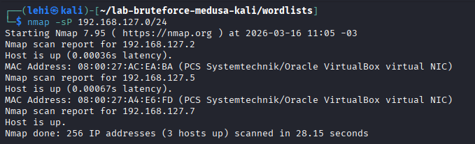
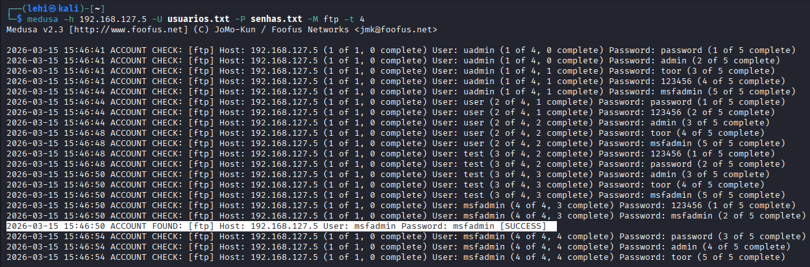
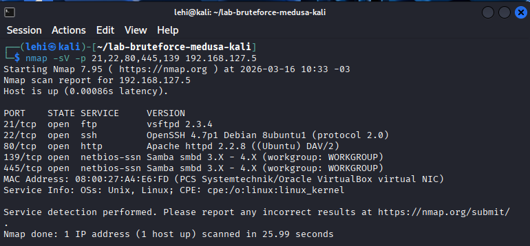
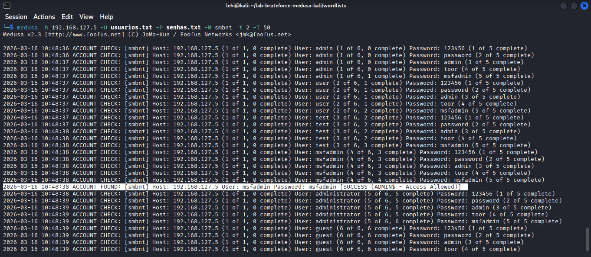

# Lab de Ataques de Força Bruta com Medusa e Kali Linux

Este repositório documenta um laboratório prático realizado para o desafio da DIO, simulando ataques de força bruta e password spraying em serviços FTP e SMB expostos em uma máquina Metasploitable 2, a partir de uma máquina atacante Kali Linux. O objetivo é entender o funcionamento desses ataques em ambiente controlado e propor medidas de mitigação.

## Ambiente de Laboratório

Para este desafio, montei um ambiente isolado em máquinas virtuais, garantindo que todos os testes fossem realizados em rede controlada.

- **Hypervisor:** Oracle VirtualBox.
- **Rede:** adaptadores configurados em modo interno/host-only, permitindo comunicação apenas entre as VMs e o host.
- **Máquina Atacante – Kali Linux**
  - IP: `192.168.127.7`
  - Principais ferramentas utilizadas: Nmap e Medusa.
- **Máquina Alvo – Metasploitable 2**
  - IP: `192.168.127.5`
  - Serviços vulneráveis habilitados por padrão, incluindo FTP e SMB.

Antes de iniciar os ataques, validei a conectividade entre as máquinas com um scan de descoberta de hosts na rede `192.168.127.0/24` utilizando o Nmap:

```bash
nmap -sP 192.168.127.0/24
```


## Ataque de Força Bruta em FTP com Medusa

Para identificar senhas fracas no serviço FTP da máquina Metasploitable 2, utilizei o Medusa a partir do Kali Linux.

Primeiro, confirmei o IP do alvo (`192.168.127.5`) com um scan na rede `192.168.127.0/24` usando o Nmap. Em seguida, executei o seguinte comando:

```bash
medusa -h 192.168.127.5 -U wordlists/usuarios.txt -P wordlists/senhas.txt -M ftp -t 4
```



## Password Spraying em SMB com Medusa

Para simular um ataque de password spraying contra o serviço SMB da máquina Metasploitable 2, reutilizei a mesma lista de usuários e defini uma lista de senhas comuns (`senhas.txt`) para serem testadas em todos os logins.

Primeiro, confirmei que as portas 21, 22, 80, 139 e 445 estavam abertas no alvo com o Nmap:

```bash
nmap -sV -p 21,22,80,445,139 192.168.127.5
```


O resultado confirmou, além do FTP na porta 21, os serviços HTTP (80/tcp) e SMB/NetBIOS (139 e 445/tcp) ativos no alvo, que foram utilizados nas etapas seguintes de teste.

Em seguida, executei o seguinte comando com o módulo `smbnt` do Medusa:

```bash
medusa -h 192.168.127.5 -U wordlists/usuarios.txt -P senhas.txt -M smbnt -t 2 -T 50
```



Diferentemente da força bruta tradicional, onde muitas senhas são testadas contra um único usuário até encontrar a combinação correta, no password spraying uma mesma senha é testada contra vários usuários. Essa abordagem reduz a chance de disparar políticas de bloqueio de conta baseadas em tentativas consecutivas de falha, ao mesmo tempo em que explora senhas fracas e reutilizadas em serviços de autenticação em rede como o SMB.

## Medidas de Mitigação

Com base nos testes realizados, algumas boas práticas para reduzir o risco de ataques de força bruta e password spraying são:

- **Fortalecer políticas de senha:** exigir senhas longas, complexas e únicas, evitando padrões fáceis como `msfadmin` ou `admin`.
- **Implementar bloqueio e delays:** configurar bloqueio temporário de contas ou aumento de delay após múltiplas falhas de login em serviços como FTP e SMB.
- **Restringir exposição de serviços:** limitar o acesso a serviços como FTP e SMB apenas a redes internas ou VPN, evitando exposição direta à internet.
- **Monitorar logs de autenticação:** coletar e analisar logs de falhas de login em busca de padrões de brute force ou spraying, integrando com soluções de SIEM/IDS.
- **Adotar autenticação adicional:** sempre que possível, complementar com MFA e revisões periódicas de contas e permissões.

## Conclusão

O laboratório demonstrou na prática como ataques automatizados com Medusa podem identificar credenciais fracas em serviços comuns como FTP e SMB em poucos segundos. A experiência reforça a importância de combinar políticas de senha robustas, configuração segura de serviços e monitoramento contínuo para mitigar esse tipo de ameaça em ambientes reais.

